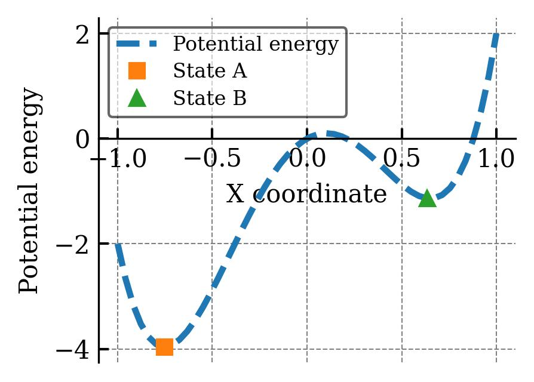
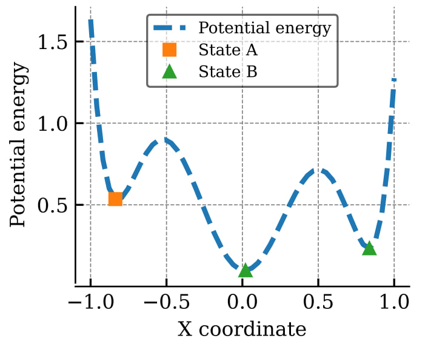
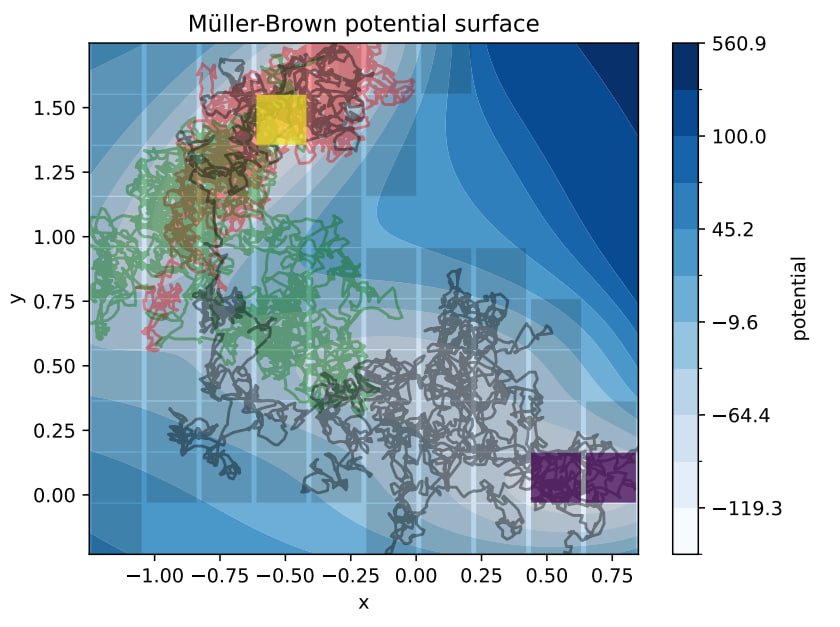

# Project overview

### Msm class code

The main class for the Markov state model (MSM) is located in `src/msm_playground/msm.py`.
This class manages creation and operation of the MSM.
An MSM can be created based either on a trajectory with clustering algorithm or a `custom_labels` integer-valued trajectory describing in which state a system is at each time step.
There are also alternative ways to create an empty MSM and set correlation (transition) matrix manually, please refer to the `tests/test_msm.py` for examples.
A created MSM can be used to compute various properties, such as:

- transition probabilities
- committor functions and corresponding linear equations for diagnostic purposes
- mean first passage times (MFPT) and corresponding linear equations for diagnostic purposes
- stationary distribution

### Diagnostic scripts

##### double well system
- `diagnostics/double_well/`

##### triple well system
- `diagnostics/triple_well/`

##### Müller-Brown system
- diagnostics/mueller_brown/mb_diagn_pipeline_committor.py
- diagnostics/mueller_brown/mb_diagn_pipeline_mfpt.py

# Plot registry

| Plot Description                                                     | Script                                                  |
| -------------------------------------------------------------------- | ------------------------------------------------------- |
| Comparing naive vs stopped process committors on triple well system  | `diagnostics/triple_well/1D_triple_well_diagnostics.py` |
| Committor approximation error on Müller-Brown system                 | `diagnostics/committor_error_new_states.py`             |
| MFPT approximation error on Müller-Brown system                      | `diagnostics/mfpt_error_new_states.py`                  |
